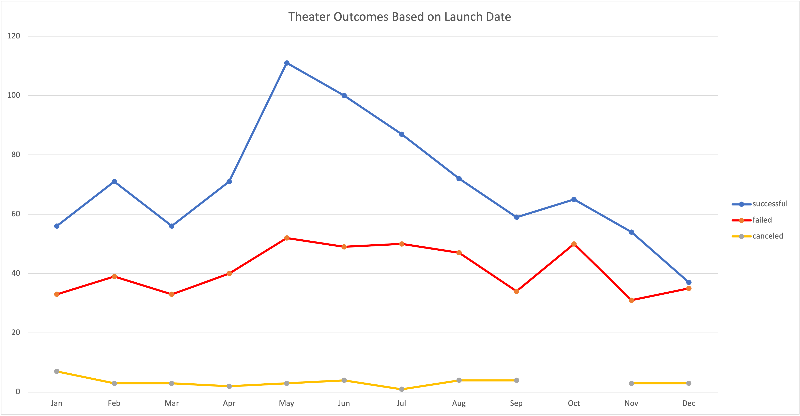
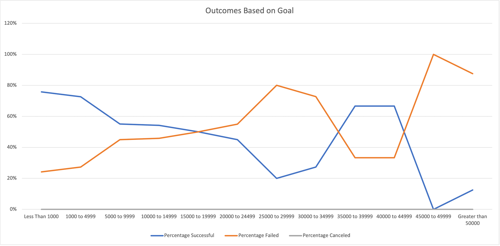

# Kickstarter Analysis of Outcomes Based on Goals and Launch Date
### This project determines how well Kickstarter Campaigns for theatre projects did based on their launch date.  It also includes outcomes based on funding goals for play productions within the theatre category.
## Analysis and Challenges
The <a href="Kickstarter_Challenge.xlsx">dataset</a> that was analyzed for this project is a subset of Kickstarter challenge data dated from 2009 to 2017.  Although this data contains many different categories the analysis is based spefically on the "theatre" category and the "plays" subcategory.  The initial set of data contained information for each campaign about the following:
**Name**, **Blurb**, **Goal**, **Pledged**, **Outcomes**, **Country**, **Currency**, **Deadline**, **Launched At**, **Staff Pick**, **Backers**, **Spotlight**, 
**Category/Subcategory**, **Percentage Funded** and **Average Donation**.   
The **Deadline** and **Launched At** dates were provided as Unix timestamps.  Two new columns were created **Date ended conversion** and **Date created conversion** and the Unix times were converted to the format Month, Day, Year and added to the two new columns respectively. A **Year** column was also added which pulled out the year of the Launch date.   
It was also necessary to split **Category/Subcategory** into two new columns one for **Category** and one for **Subcategory** in order to be able to look at the Theatre category for one analysis and the Play subcategory for the other. 

### Analysis of Outcomes Based on Launch Date
In order to properly provide an analysis of the theatre outcomes by launch date a pivot table was used.   A filter was added for category, theatre, and the year.  The next step is to determine if the Kickstarter campaign is a success, failure or canceled. The **Outcomes** column of the main spreadsheet contains this information and is used.  This measurement is based on whether the amount pledged met the goal desired.  The total number of successes, failures and canceled theatre campaigns are calculated by the month the campaign was launched and each month is a row in the pivot table.  

   
In this line chart the blue line is for successes, the red line represents failures and the yellow line shows those that were canceled.  By looking at the chart it is easy to see that the month of May was the most successful for theatre campaigns, while the month of December was the least successful.  

  
  
### Analysis of Outcomes Based on Goals
Another part of the analysis was to determine the number of successful, failed, and canceled theatre projects that were specifically play productions.  Instead of looking at launch date for this analysis the **Goal** column from the dataset was used.  The dollar amount is broken down into 12 rows.  Starting with goals less than 1000 and moving up in increments of 5000 all the way to goals greater than 50000.  The total number of successful, failed and canceled projects are then calculated based on the parameters of the goal.  

   

  

### Challenges and Difficulties Encountered
## Results
### Conclusions about Theatre Outcomes by Date
### Conclusions about Outcomes Based on Goals
### Limitations of Dataset
### Other possible information that could be included
